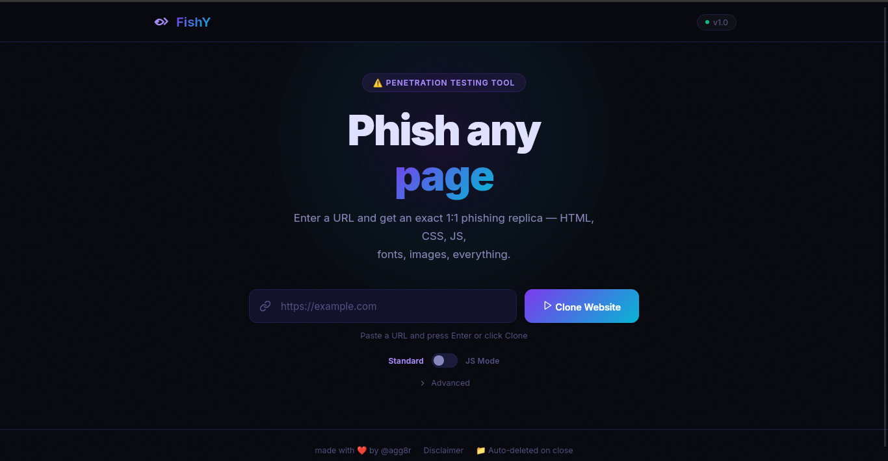
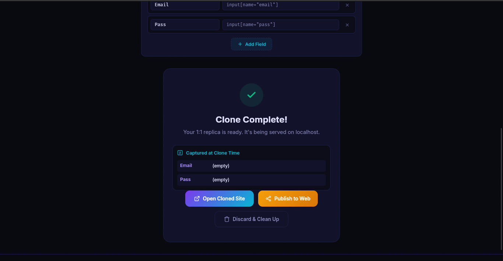
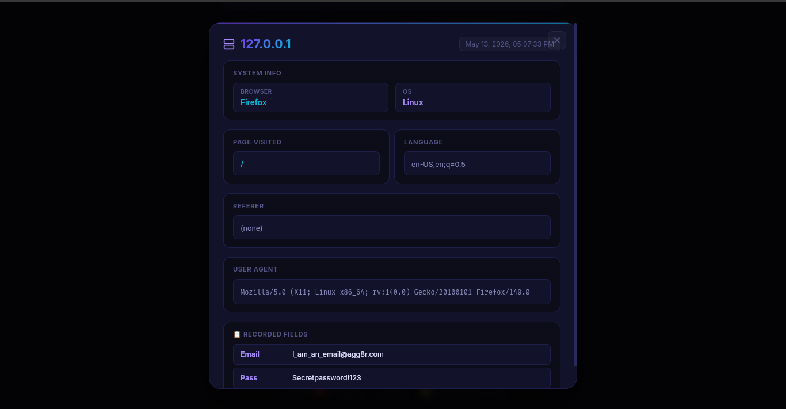

<div align="center">

# 🐟 FishY

### Website Replication & Frontend Analysis Platform

<p align="center">
  
  
  
  
</p>

<p align="center">
  Pixel-perfect website cloning for security research, offline analysis, and phishing-awareness demonstrations.
</p>

</div>

---

# Overview

FishY is a desktop-based website phishing builder built for:

* Security research
* Frontend analysis
* Website mirroring
* Phishing-awareness demonstrations
* Authorized penetration testing

FishY supports both:

* standard static mirroring
* JavaScript-rendered browser cloning via Playwright

---

# Features

| Feature              | Description                             |
| -------------------- | --------------------------------------- |
| Playwright Cloning | Clone modern JS-heavy websites          |
| Asset Localization   | Rewrites external assets to local paths |
| Visitor Analytics    | Basic session telemetry dashboard       |
| Dual Clone Modes     | Wget + Playwright support               |
| Desktop UI           | PyWebView-based native interface        |
| Live Logs            | SSE progress streaming                  |
| Automatic Cleanup    | Removes generated files automatically (for ultimate opsec)  |
| CDN Discovery        | Detects external asset domains          |
| Responsive UI        | Glass-style dark dashboard              |
| Clone Management     | Built-in session controls               |

---

# Screenshots

## Dashboard

<p align="center">
  
</p>

---

## Clone Progress

<p align="center">
  
</p>

---

## Visitor Analytics

<p align="center">
  
</p>

---


# Technology Stack

| Category           | Technologies          |
| ------------------ | --------------------- |
| Backend            | Flask, Python         |
| Frontend           | HTML, CSS, JavaScript |
| Browser Automation | Playwright            |
| Desktop Wrapper    | PyWebView             |
| Mirroring          | wget                  |
| Streaming          | SSE                   |

---

# Installation

## macOS / Linux

```bash
git clone https://github.com/nhatminhne0574-ship-it/FishY/ && \
cd FishY && \
chmod +x setup.sh && \
./setup.sh && \
python3 app.py
```

---

## Windows

```powershell
git clone https://github.com/nhatminhne0574-ship-it/FishY/
cd FishY
pip install -r requirements.txt
playwright install chromium
python app.py
```

---

# Project Structure

```text
FishY/
├── app.py
├── fishy.py
├── templates/
├── static/
├── cloned_site/
└── assets/
```

---

# Clone Modes

| Mode     | Purpose                                   |
| -------- | ----------------------------------------- |
| Standard | Static mirroring using wget               |
| JS Mode  | Browser-rendered cloning using Playwright |

---

# Security Notice

FishY is intended strictly for:

* educational purposes
* authorized security testing
* phishing-awareness demonstrations
* controlled lab environments

Unauthorized phishing or credential harvesting against real users may violate laws and platform policies.

Users are solely responsible for how they use this software.
